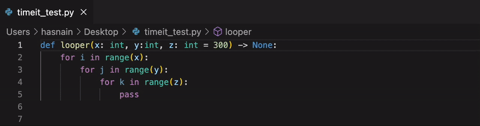
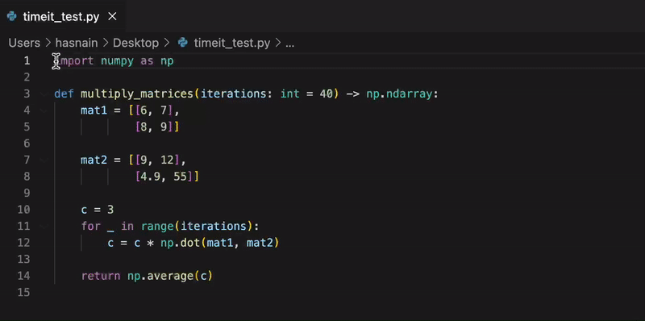

# Visual Studio Code Extension - Python TimeIt

    

---

View the execution time of any Python function on the fly.

## Features

* Simply select/highlight the entire function (including import statements if required) with the cursor and trigger the `Time It` command. 

* The generated function call with the specified arguments and the execution time is inserted as a comment below the selected code.

* Uses the built-in Python3 [time](https://docs.python.org/3/library/time.html) module to efficiently compute the execution time.

* Handles various kinds of Python function definitions, including type hints and default values.

## Installation 
The extension can be installed from the [Visual Studio Marketplace](https://marketplace.visualstudio.com/items?itemName=HasnainRoopawalla.vscode-python-timeit).

## Contributing
The source code for this extension is hosted on [GitHub](https://github.com/hasnainroopawalla/vscode-python-timeit).

- Post any issues and suggestions to the GitHub [issues](https://github.com/hasnainroopawalla/vscode-python-timeit/issues) page.
- To contribute, fork the project and then create a pull request back to master. 

## License
This project is licensed under the MIT License - see the [LICENSE](https://github.com/hasnainroopawalla/vscode-python-timeit/blob/6b24b401f4e5ed32dadddfa35636249af3741129/LICENSE) file for details