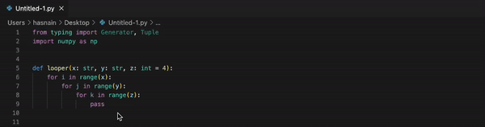

# VS Code Python TimeIt

Quickly view the execution time of a Python function by providing custom argument values.

## Features

* Simply select the entire function (including import statements if required) with the cursor and triggger the `Time It` command. 

* The generated function call with the specified arguments and the execution time is inserted as a comment above the selected code.

* Uses the built-in Python3 [time](https://docs.python.org/3/library/time.html) module to efficiently compute the execution time.

* Handles various types of Python function definitions including type hints and default values.

## Known Issues

* The parser fails for Python functions which contain type hints for return type(s).
* 
